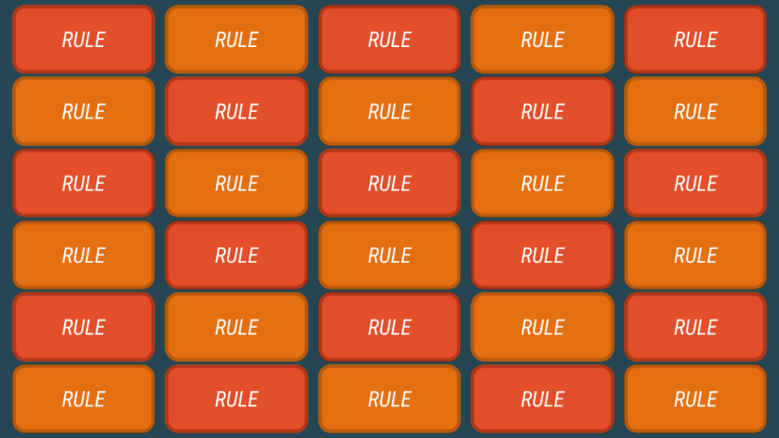
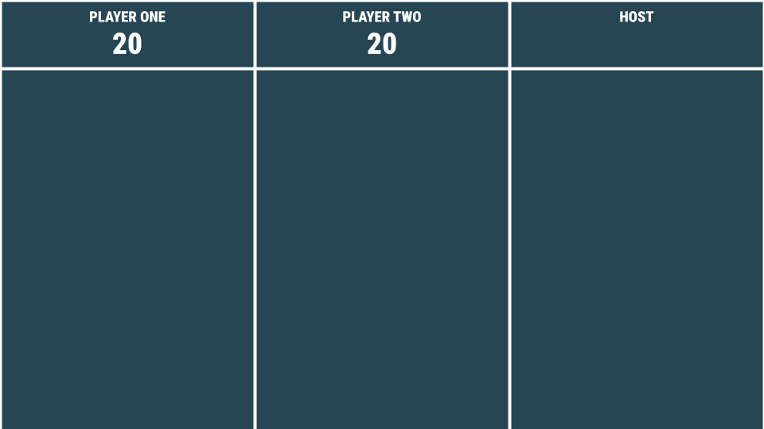

# Rulette

An Apps Script extension that transforms a Google Slides presentation into a multi-player board game based on the _Game Changer_ episode ["Rulette"](https://watch.dropout.tv/videos/rulette).

All players must have functional Google accounts.

> [!WARNING]
> This section contains spoilers for:
> - the _Game Changer_ episode "Rulette"; and
> - this board game.

## How to use this repository

### Set up the Google Slides presentation

Before the game begins, the host should create a brand new Google Slides presentation and initialise it as follows.

1. In the toolbar, select `Extensions > Apps Script`. This opens up a code editor where a code template for a new Apps Script project is shown. Scripts created in this editor will be automatically bound to the Google Slides presentation. (See the documentation for container-bound scripts [here](https://developers.google.com/apps-script/guides/bound).)
2. Delete the `.gs` file containing the code template.
3. Add the Apps Script code in this repository to the newly created project. There are two ways to do this:
    - For each `.gs` file in this repository, create a corresponding `.gs` file in the code editor. Copy and paste the contents over.
    - Clone this repository and run the Bash script `combine_into_one_file.sh`, which automatically combines the contents of all `.gs` files in this repository into one. This script takes one positional argument: the path to the output file (e.g. `./combine_into_one_file.sh dist/output_file.gs`). After the script is executed, copy and paste the contents of this output file to a new file in the Apps Script code editor.
4. Save changes.
5. Close and reopen the Google Slides presentation. A `Rulette` menu should be added to the toolbar.

### The `Rulette` menu

The custom `Rulette` menu provides buttons corresponding to the game mechanics of Rulette, as explained below.

- `Add rules slide`

  - Initialises the game board by creating a new slide containing 30 stacks of "cards", i.e. layered rounded rectangles.

  - Each stack contains, in order from top to bottom:
    - a "RULE" cover card;
    - a card describing a rule;
    - either a "PROMPT" or a "MODIFIER" cover card; and
    - a card describing either a prompt or a modifier.

&nbsp;

   
  A generated rule board with 30 stacks of cards.

&nbsp;

- `Add empty slide`

  - Adds an empty slide, in line with the custom colour palette, to the presentation.
  
  - Such an empty slide may be manually customised to display each player's score and active rules.

&nbsp;

   
  An example scoreboard slide.

&nbsp;

- `Add host rule`

  - Adds a `Hosts the game` rule to the active slide.

- `Flip selected rule`

  - Flips the currently selected rule.

  - Only one rule may be flipped at a time.

### Notes

- In lieu of a giant wheel, players may opt for dice or random number generators.

- To transfer hosting responsibilities to another player, share the presentation with the new host. Ensure that the new host is authorised to edit the file. The new host is also required to explicitly trust the app's developer before using the Apps Script extension's functionalities.
